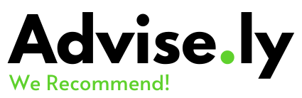

Advise.ly is a French company based in Lannion and created in 2020. Our team is composed of six engineers specialized in data processing. At Advise.ly, we work together to design, create and produce work that we are proud of for people that we believe in. We help other companies by providing them tailored recommendation systems.

We are specialized in developing recommendation software systems. However, our background allows us to diversify our activities with consulting. We make every effort to satisfy our clients as much as possible.

Advise.ly has two main activities, the first one is providing support to  companies regarding applications development. And the second is research and development of new solutions.

## Key dates

* January 2020 : Company creation
* February 2020 : First project -  Classified Government Project
* June 2020 : Second project - LeaveManager
* September 2020 : Third project : Recofinement

## Geographic location

Our company is based at ENSSAT in Lannion (22), more precisely in the business incubator area. The address of Advise.ly is 6 rue de Kerampont, CS 80518, 22305 Lannion.

## Our team

BOSQUET Corentin:
    *Software & design engineer*

CHANTREL Romain:
    *Project manager, Software & data analyst engineer*

GALLIOU Quentin:
    *Cybersecurity engineer*

PERROT Yohan:
    *Research engineer*

ROLLIN Lucas:
    *Communication manager & software engineer*
