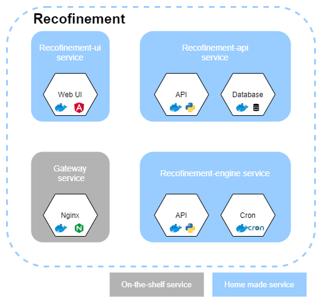
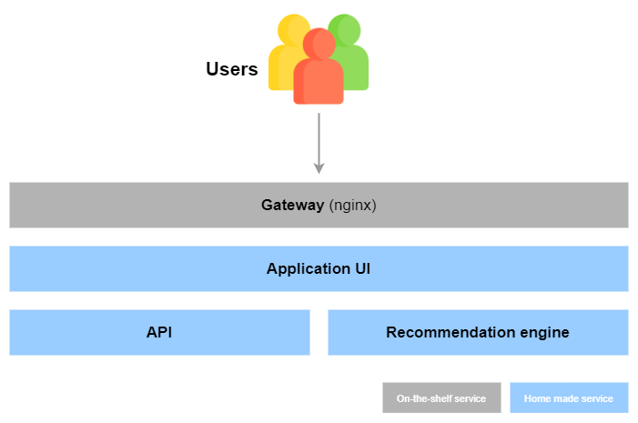

We use a micro-service architecture.

[Nginx service](../services/nginx) is our reverse proxy. All requests to access the application go through here.

[UI service](../services/ui) is the entrance door for users, it is the interface that will allow them to use the entire application.

[API service](../services/api) is the BackEnd. It is the brain of the application, responsible for managing user access and actions.

[Engine service](../services/engine) is the one who calculates the recommendations for the users.

!!! tip "These two diagrams below can help you to understand how these services are organised."

## Macro architecture

## Functional macro architecture

!!! tip
    You will find more information about each services on their owns pages.
