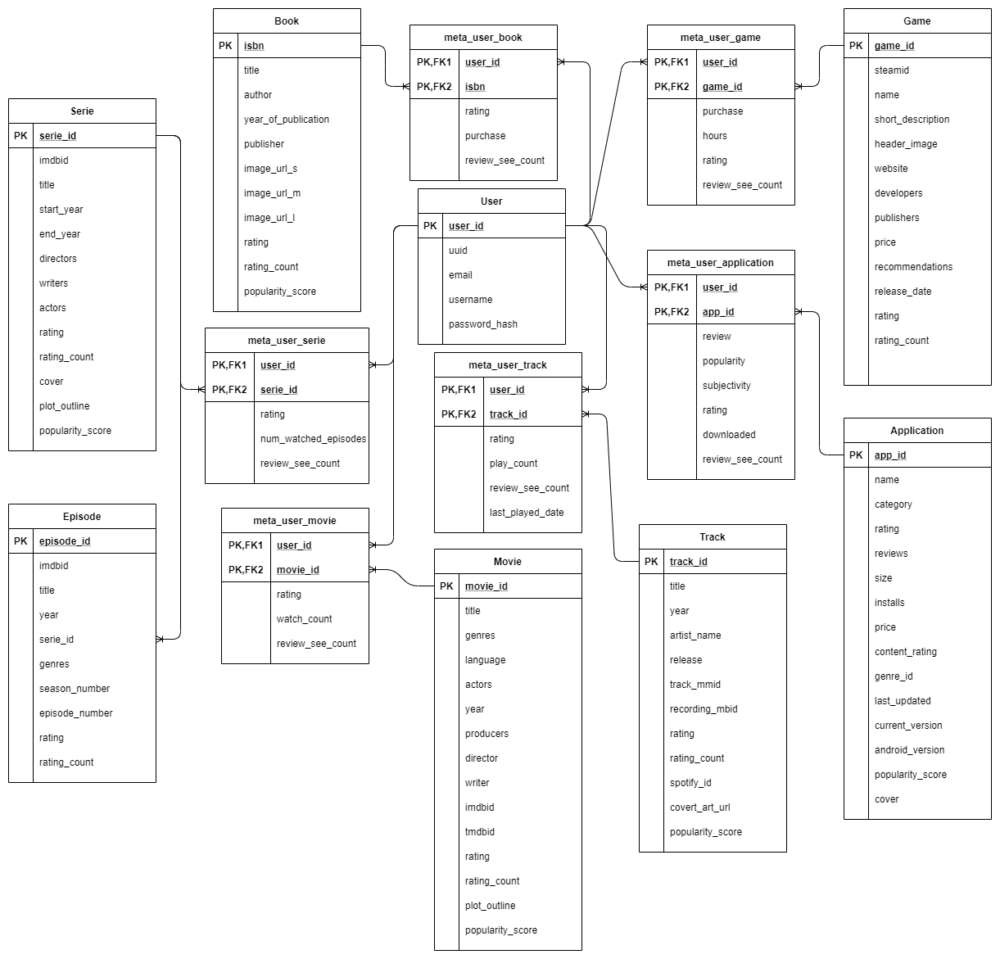
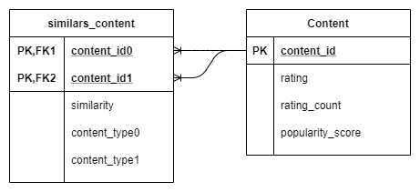
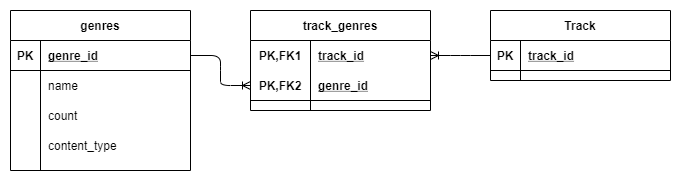
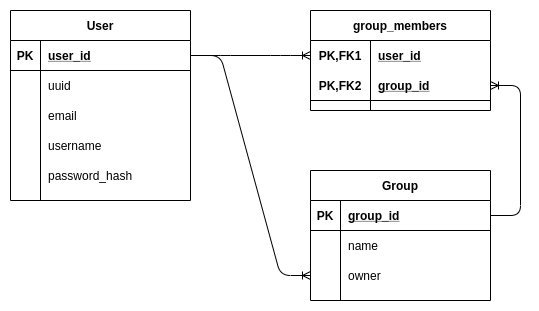
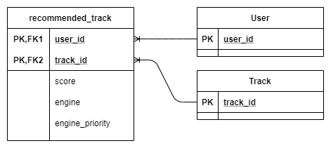
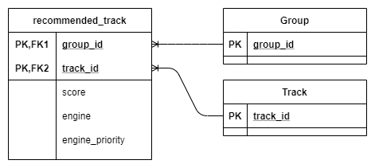

!!! important
    We use __PostgreSQL__ as DBMS *(Data Base Management System)*. You will find more informations about it [here](https://www.postgresql.org/).

## Media objects definition

### Application

| Name | Type | Description |
|---|---|---|
| __app_id__ | __Integer__ | __Application identifier__ |
| name | String | Application name |
| categorie | Integer | linked categorie ([genre](#genre)) |
| rating | Float | Average of user's rating |
| reviews | String | Number of reviews |
| size | String | Application size
| installs | String | Number of installations by unique user |
| type | String | 'Paid' or 'Free' |
| price | String | Price |
| content_rating | String | application classification (by age group) |
| last_updated | String | last update date |
| current_version | String | current app version number |
| android_version | String | minimum android version required |
| cover | String | cover url |
| popularity_score | Float | popularity score (see [here](../services/engine/#popularity)) |

!!! important
    Unlike other media, applications are linked to only one genre.

### Book

| Name | Type | Description |
|---|---|---|
| __isbn__ | __String__ | __Book universal identifier__ |
| title | String | Book title |
| author | String | Book author |
| year_of_publication | Integer | Year of publication |
| publisher | String | Publisher company |
| image_url_s | String | URL for small image size |
| image_url_m | String | URL for medium image size |
| image_url_l | String | URL for large image size |
| rating | Float | Average rating |
| rating_count | Integer | Number of user rating |
| popularity_score | Float | popularity score (see [here](../services/engine/#popularity)) |

### Episode

| Name | Type | Description |
|---|---|---|
| __episode_id__ | __Integer__ | __Episode identifier__ |
| imdbid | String | IMDB identifier |
| title | String |  |
| year | Integer | release year |
| genres | String | List of genres |
| serie_id | Integer | [Serie](#series) identifier |
| season_number | Integer |  |
| episode_number | Integer |  |
| rating | Float | Average rating |
| rating_count | Integer | Number of user rating |

### Game

| Name | Type | Description |
|---|---|---|
| __game_id__ | __Integer__ | __Game identifier__ |
| steamid | Integer | Steam game identifier |
| name | String | Game name |
| short_description | Text |  |
| header_image | String |  |
| website | String | URL of official game website |
| developers | String | developers company name |
| publishers | String | publisher company name |
| price | String |  |
| recommendations | Integer | Number of user recommendations |
| release_date | String |  |
| rating | Float | Average rating |
| rating_count | Integer | Number of user rating |
| popularity_score | Float | popularity score (see [here](../services/engine/#popularity)) |

### Movie

| Name | Type | Description |
|---|---|---|
| __movie_id__ | __Integer__ | __Movie identifier__ |
| title | String | Movie title |
| language | String | Main language |
| actors | String | List of main actors separated by '\|' |
| year | String | Release year |
| producers | String | List of producers separated by '\|' |
| director | String | Name of the director |
| writer | String | Name of the writer |
| imdbid | String | IMDB movie identifier |
| tmdbid | String | TMDB movie identifier |
| rating | Float | Average rating |
| rating_count | Integer | Number of user rating |
| cover | String | Cover url |
| plot_outline | String | synopsis |
| popularity_score | Float | popularity score (see [here](../services/engine/#popularity)) |

### Series

| Name | Type | Description |
|---|---|---|
| __serie_id__ | __Integer__ | __Serie identifier__ |
| imdbid | String | IMDB identifier |
| title | String |  |
| start_year | Integer |  |
| end_year | Integer |  |
| writers | Text | List of writers separated by ',' |
| directors | Text | List of directors separated by ',' |
| actors | Text | List of actors separated by ',' |
| rating | Float | Average rating |
| rating_count | Integer | Number of user rating |
| cover | String | Cover url |
| plot_outline | String | synopsis |
| popularity_score | Float | popularity score (see [here](../services/engine/#popularity)) |

### Track

| Name | Type | Description |
|---|---|---|
| __track_id__ | __Integer__ | __Track identifier__ |
| title | String | Track title |
| year | Integer | Release year |
| artist_name | String | Artist name |
| release | String | Realse (album) associated with this track |
| track_mmid | String | Million Song track indentifier |
| recording_mbid | UUID | MusicBrainz track identifier |
| rating | Float | Average rating |
| rating_count | Integer | Number of user rating |
| spotify_id | String | Track spotify id |
| covert_art_url | Text |  |
| popularity_score | Float | popularity score (see [here](../services/engine/#popularity)) |

## Other objects definition

### Genre

| Name | Type | Description |
|---|---|---|
| __genre_id__ | __Integer__ | __Genre identifier__ |
| name | String | genre name |
| count | Integer | number of user |
| content_type | Enum | APPLICATION, BOOK, GAME, MOVIE, SERIE or TRACK |

### Group

| Name | Type | Description |
|---|---|---|
| __group_id__ | __Integer__ | __Group identifier__ |
| name | String | Group name |
| owner_id | Integer | [User](#user) identifier |

### User

| Name | Type | Description |
|---|---|---|
| __user_id__ | __Integer__ | __User internal identifier__ |
| uuid | UUID |  User public identifier |
| email | String | user email |
| username | String |  |
| password_hash | String | Hashed user password (Bycrypt algorithm) |
| preferences_defined | Boolean |  |

### External

| Name | Type | Description |
|---|---|---|
| __service_id__ | __Integer__ | __Service internal identifier__ |
| user_id | Integer | [User](#user) identifier |
| service_name | String |  |
| access_token | String |  |
| refresh_token | String |  |

## Schema

### User - Content realtionship

All content is linked with user by `meta_user_X` table, it will define all metadata between a content and the user:

Example:

- Explicit metadata: rating
- Implicit metadata: play_count

### Content similarity

All content table have a "Many to many" relationship with itself, it store the ratio of similarity between two contents (only the highest will be stored).

### Content genres

Apart from [Application](#application) and [Book](#book), all the others content table have a "Many to many" relationship with [Genre](#genre) table.

!!! caution
    * We do not have any data allowing us to define the genre of a [book](#book).
    * And [applications](#application) are linked to only one genre.

### User social part

A user can create a group, and add other user to this group, the objective is to be able to make recommendations to the group (e.g. Playlist for a party with friends).

### User Interests

A user can like or not a genre.

### Content Recommendation for users

All recommendations calculated by [Recofinement-engine](../services/engine) are stored in this table. This service use multiple algorithme (called engine) to recommend a user. Each engine calculate a score between 0 and 1 between a [user](#user) and a content. The closer the score is to 1, the more relevant it will be.

!!! important
    It is not relevant to compare scores between two different engines. That's why we have a column `engine_priority`

### Content Recommendation for groups

The mechanism for the recommendation for a group is the same. We see a [group](#group) object as a [user](#user) object.

