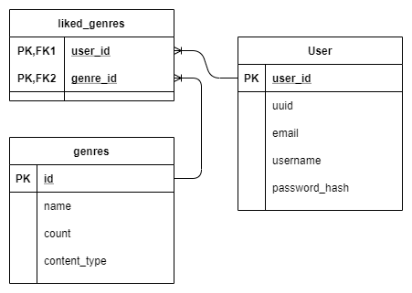

!!! important
    We use __PostgreSQL__ as DBMS *(Data Base Management System)*. You will find more informations about it [here](https://www.postgresql.org/).

## Objects definition

### Application

| Name | Type | Description |
|---|---|---|
| __app_id__ | __Integer__ | __Application identifier__ |
| name | String | Application name |
| category | String | Category of the application (example: ART_AND_DESIGN)
| rating | Float | Average of user's rating |
| reviews | String | Number of reviews |
| size | String | Application size
| installs | String | Number of installations by unique user |
| type | String | 'Paid' or 'Free' |
| price | String | Price |
| content_rating | String | Number of user rating |
| genres | String | List of genre separated by ';' |
| last_updated | String | last update date |
| current_version | String | current app version number |
| android_version | String | minimum android versionrequired |

### Book

| Name | Type | Description |
|---|---|---|
| __isbn__ | __String__ | __Book universal identifier__ |
| title | String | Book title |
| author | String | Book author |
| year_of_publication | Integer | Year of publication |
| publisher | String | Publisher company |
| image_url_s | String | URL for small image size |
| image_url_m | String | URL for medium image size |
| image_url_l | String | URL for large image size |
| rating | Float | Average rating |
| rating_count | Integer | Number of user rating |

### Episode

| Name | Type | Description |
|---|---|---|
| __episode_id__ | __Integer__ | __Episode identifier__ |
| imdbid | String | IMDB identifier |
| title | String |  |
| year | Integer | release year |
| genres | String | List of genres |
| serie_id | Integer | Serie identifier |
| season_number | Integer |  |
| episode_number | Integer |  |
| rating | Float | Average rating |
| rating_count | Integer | Number of user rating |

### Game

| Name | Type | Description |
|---|---|---|
| __game_id__ | __Integer__ | __Game identifier__ |
| steamid | Integer | Steam game identifier |
| name | String | Game name |
| short_description | Text |  |
| header_image | String |  |
| website | String | URL of official game website |
| developers | String | developers company name |
| publishers | String | publisher company name |
| price | String |  |
| genres | String | List of genre separated by ',' |
| recommendations | String | Number of user recommendations |
| release_date | String |  |

### Genre

| Name | Type | Description |
|---|---|---|
| __genre_id__ | __Integer__ | __Genre identifier__ |
| name | String | genre name |
| count | Integer | number of user |
| content_type | Enum | APPLICATION, BOOK, GAME, MOVIE, SERIE or TRACK |

### Group

| Name | Type | Description |
|---|---|---|
| __group_id__ | __Integer__ | __Group identifier__ |
| name | String | Group name |
| owner_id | Integer | User identifier |

### Movie

| Name | Type | Description |
|---|---|---|
| __movie_id__ | __Integer__ | __Movie identifier__ |
| title | String | Movie title |
| genres | String | List of genres separated by '\|' |
| language | String | Main language |
| actors | String | List of main actors separated by '\|' |
| year | String | Release year |
| producers | String | List of producers separated by '\|' |
| director | String | Name of the director |
| writer | String | Name of the writer |
| imdbid | String | IMDB movie identifier |
| tmdbid | String | TMDB movie identifier |
| rating | Float | Average rating |
| rating_count | Integer | Number of user rating |
| cover | String | Cover url |

### Serie

| Name | Type | Description |
|---|---|---|
| __serie_id__ | __Integer__ | __Serie identifier__ |
| imdbid | String | IMDB identifier |
| title | String |  |
| start_year | Integer |  |
| end_year | Integer |  |
| genres | String | List of genres |
| writers | Text | List of writers separated by ',' |
| directors | Text | List of directors separated by ',' |
| actors | Text | List of actors separated by ',' |
| rating | Float | Average rating |
| rating_count | Integer | Number of user rating |

### Track

| Name | Type | Description |
|---|---|---|
| __track_id__ | __Integer__ | __Track identifier__ |
| title | String | Track title |
| year | Integer | Release year |
| artist_name | String | Artist name |
| release | String | Realse (album) associated with this track |
| track_mmid | String | Million Song track indentifier |
| recording_mbid | UUID | MusicBrainz track identifier |
| language | String |  |
| rating | Float | Average rating |
| rating_count | Integer | Number of user rating |
| spotify_id | String | Track spotify id |
| covert_art_url | Text |  |

### User

| Name | Type | Description |
|---|---|---|
| __user_id__ | __Integer__ | __User internal identifier__ |
| uuid | UUID |  User public identifier |
| email | String | user email |
| username | String |  |
| password_hash | String | Hashed user password (Bycrypt algorithm) |

## Schema

!!! info
    All scheme may be subject to change at a later date depending on the progress of the project.

!!! failure
    There is no relationship between users and series in the datasets we used.
    Cold start problem for series.

### User - Content realtionship

All content is linked with user by `meta_user_X` table, it will define all metadata between a content and the user:

Example:

- Explicit metadata: rating
- Implicit metadata: play_count

### Content similarity

All content table will have a "Many to many" relationship with itself, it will store the ratio of similarity between two contents (only the highest will be stored).

### User social part

A user can create a group, and add other user to this group, the objective is to be able to make recommendations to the group (e.g. Playlist for a party with friends).

### User Interests

A user can like or not a genre. A genre can be linked to another genre like content similarity.

