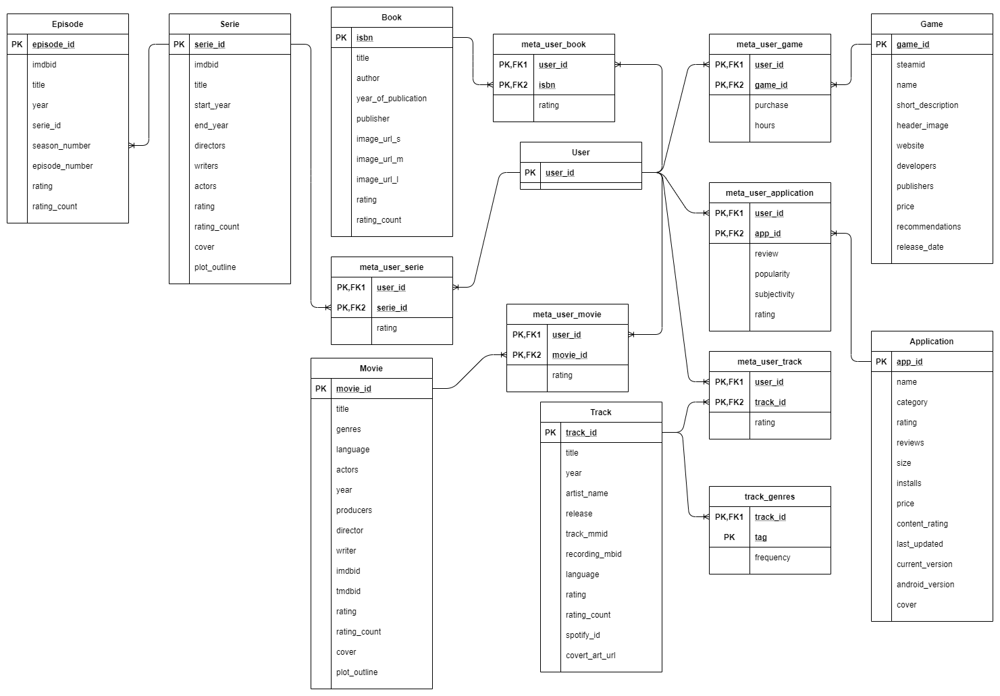

!!! info
    You can find all data source [here](https://github.com/RomainCtl/RecoFinement-Datasets)

!!! caution
    All user data has been anonymised.

## Some numbers

### Music

- 9 075 unique tracks
- 729 995 user - track - rating

### Movies

- 58 099 unique movies
- 27 753 445 user - movie - rating

### Serie

- 73 504 unique series
- 5 171 349 unique episodes
- 86 389 462 user - series - rating

### Games

- 5 154 unique games
- 128 793 user - game - played hours - purchase

### Books

- 271 380 unique books
- 1 031 176 user - book - rating

### Applications (mobile)

- 9 661 unique app
- 35 930 user - app - review - review popularity - review subjectivity - rating

## Content sources

### Music

- [MusicBrainz Dataset](https://musicbrainz.org/doc/MusicBrainz_Database): This data includes information about artists, release groups, releases, recordings, works, and labels, as well as the many relationships between them.
- [Taste Profile (subset)](http://millionsongdataset.com/tasteprofile/): The dataset contains real user - play counts from undisclosed partners, all songs already matched to the MSD.
- [LastFM (Implicit) (subset)](https://grouplens.org/datasets/hetrec-2011/): This dataset contains social networking, tagging, and music artist listening information from a set of 2K users from Last.fm online music system.
- [Million Song Dataset (subset)](https://labrosa.ee.columbia.edu/millionsong/): The Million Song Dataset is a freely-available collection of audio features and metadata for a million contemporary popular music tracks.

### Movies

- [MovieLens](https://grouplens.org/datasets/movielens/): The data sets were collected over various periods of time, depending on the size of the set.

- [TMDB](https://www.themoviedb.org/): All movies and series metadata

### Serie

- [TMDB](https://www.themoviedb.org/): All movies and series metadata

### Games

- [Steam video games Kaggle](https://www.kaggle.com/tamber/steam-video-games/data): This dataset is a list of user behaviors, with columns: user-id, game-title, behavior-name, value. The included behaviors  are 'purchase' and 'play'.
- [Steam app list](https://api.steampowered.com/ISteamApps/GetAppList/v2/): List of (appid, name) steam app.
- [Steam open API](https://store.steampowered.com/api/appdetails/?appids=1): Api that provides application details from app_id.

### Books

- [Book Crossing](http://www2.informatik.uni-freiburg.de/~cziegler/BX/): The BookCrossing (BX) dataset was collected by Cai-Nicolas in a 4-week crawl (August / September 2004) from the Book-Crossing community

### Applications (mobile)

- [Google play store (Kaggle)](https://www.kaggle.com/lava18/google-play-store-apps)
