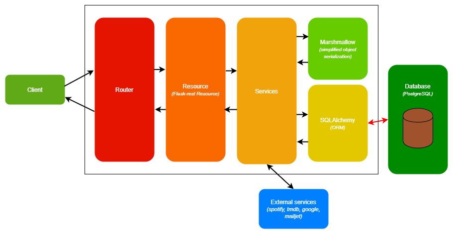

[See the repository](https://github.com/RomainCtl/RecoFinement-api)

This service is the BackEnd. It is the brain of the application, responsible for managing user access and actions.

We choose to use __JWT__ (Json Web Token) for the authentification. When the user successfully logs in using their credentials, a JWT will be returned. The returned token is signed using a private secret.

We have chosen to use __bcrypt__ to store passwords. It is a password hashing function based on __blowfish__ cipher. It incorporate a __salt__ to protect against rainbow table attacks. It is resistant to brute-force search attacks even with increasing computation power.

## Techonologies

We use Flask web framework, it is a micro framework written in Python. It is classified as a micro framework because it does not require specific tools or libraries. It has no database abstraction layer, form validation, or any other components where pre-existing third-party libraries provide common functions.

However, Flask supports extensions that can add application features as if they were implemented in Flask itself.

[Flask documentation](https://flask.palletsprojects.com/en/1.1.x/)

### Used Flask Extensions

!!! note
    Here you can find a description of each flask extension we use.

#### Flask Restx

The official documentation can be found at [flask-restx](https://flask-restx.readthedocs.io/en/latest/).

Flask-Restx is an extension for Flask that adds support for quickly building REST APIs.

It encourages best practices with minimal setup. Flask-Restx expose a [swagger](https://swagger.io/) documentation properly.

#### Flask SQLAlchemy

The official documentation can be found at [flask-sqlachemy](https://flask-sqlalchemy.palletsprojects.com/en/2.x/).

Flask-SQLAlchemy is an extension that adds support for SQLAlchemy to our application. It aims to simplify using SQLAlchemy with Flask.

SQLALchemy is an object relational mapper (ORM), See [flask-sqlalchemy documentation](https://docs.sqlalchemy.org/en/latest/) to see how to work with the ORM in depth.

#### Flask Marshmallow

The official documentation can be found at [flask-marshmallow](https://flask-marshmallow.readthedocs.io/en/latest/).

Flask-Marshmallow is a thin integration layer for Flask and marshmallow (an object serialization/deserialization library).

It also integrates with Flask-SQLAlchemy.

Here a link to the official [Marshmallow documentation](https://marshmallow.readthedocs.io/en/latest/).

#### Flask Bcrypt

The official documentation can be found at [flask-brcypt](https://flask-bcrypt.readthedocs.io/en/latest/).

Flask-Bcrypt is a Flask extension that provides bcrypt hashing utilities for your application.

You will find more information about Bcrypt [here](https://en.wikipedia.org/wiki/Bcrypt)

#### Flask Cors

The official documentation can be found at [flask-cors](https://flask-cors.readthedocs.io/en/latest/).

Flask cors is a Flask extension for handling Cross Origin Resource Sharing (CORS), making cross-origin AJAX possible.

You will find more information about CORS in [Mozilla developer doc](https://developer.mozilla.org/en-US/docs/Web/HTTP/CORS).

#### Flask JWT extended

The official documentation can be found at [flask-jwt-extende](https://flask-jwt-extended.readthedocs.io/en/stable/).

Flask JWT extended is an open source Flask extension that provides JWT support.

You will find more information about JWT in [official JWT website](https://jwt.io/).

## Api Architecture Schema

!!! info
    We use external services to send mail and to link user accounts, more information [here](../../external_services/mailjet).
