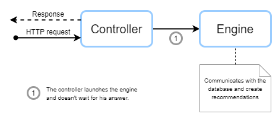
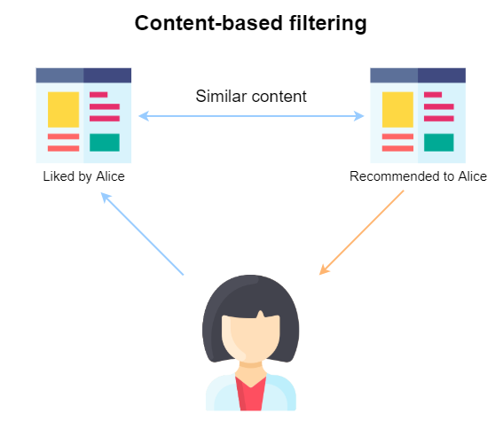
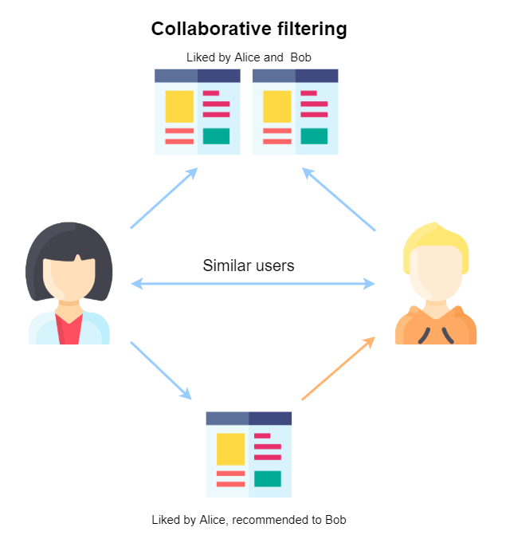

[See the repository](https://github.com/RomainCtl/RecoFinement-engine)

This service is the one who calculates the recommendations for the users.

In production environement, this service uses a cron (also known has cront job). A cron is a time-based job scheduler un Unix-like computer operating systems.

This cron will send a request to this service to refresh recommendations.

Eeah recommendation algorithme can now be launch alone, to fit the need of the sandbox. 


## Processing of a request

We will explain how a request is processed in Recofinement-engine. Below is an explanatory diagram.




## Engine

We use several algorithms to recommend users.

### Popularity

The main purpose of this engine it to set a popularity score for each media.

We use the __IMDB__ top-250 formula. This formula gives a __true Bayesian estimate__:
```
weighted rating (WR) = (v / (v+m)) * R + (m / (v+m)) * C
```
With:

* R = average rating for the media (mean)
* v = number of votes (rating) for the media
* m = minimum votes (number of rating) required to be listed
* C = the mean vote across the whole report.

### Content similarity

The main purpose of this engine is to define similar items for a particular item.

To do this, we use all __word__ we can find in media fields, and we create a "soup" of it. i.e. a field containing all the words found.

From this, we can create a __dictionary of the vocabulary__ used. And of courses, we do not take the 'this', 'is', 'a', ... words for this dictionary.

Then, we construct a __TF-IDF__ (term frequency–inverse document frequency) matrix. It is a numerical statistic that is intended to reflect how important a word is in a collection.

Lastly, we define a score between each item using __cosinus similarity__. It is a measure of similarity between two vectors, it is defined to equal the cosine of the angle between them.

### Create link between items

Natively, we have no link between different types of content. So we decided to create a link between the following content:

* movies: series, books
* series: movies, books
* music: series, movies
* game : movies, series
* books : None
* applications: None

There is no database linking items from different media. So we can only link item with the __title__. We use the same algorithm that for the [Content similarity](#content-similarity) engine, but we only use the title attribute.

### Content-base filtering

The following two systems use what the user already likes (explicitly and/or implicitly) to recommend content to the user.



#### From profile

The main purpose it to recommend items based on the __profile__ of a user or a group. It is the construction of the genre of "liked" item + explicit liked genres.

We use explicit and implicit data to make recommendations with this engine (see all metadata between a user and a content [here](../../database/#user-content-realtionship)).

You will notice that each media has its own meta data. For the sake of simplification, we only use commons field, so `rating` (explicit) and `review_see_count` (implicit).

The first step is to retrieve all user (we exclude anonymous users retrieved from datasets).

For each of these users, we retrieve its 'liked' contents (those he/she __noted__, and those he/she __watched__).

Knowing that each media is linked to a list of genres, with this list of content, we can create the "genre" profile for a user. To be more specific, we turn each genre into __weights__ and we take into account [explicit user interests](../../database/#user-interests).

With the input's profile and the complete list of media and their genres in hand, we are going to take the __weighted average of every media__ based on the input profile and recommend the top media that most satisfy it (increased to 200 media).

!!! note
    This engine is not used for [Application](../../database/#application) because an application is linked to only one genre, and for [Book](../../database/#book) because we do not have data allowing us to define its genre(s).

#### From similar content

The main purpose of this engine is to recommend similar items based on the user "liked" content.

As with [From profile](#from-profile), we retrieve users and his/her 'liked' content (only if rating is higher than 3).

From this list, we recover their similar content. The more an item is liked, the more its similar contents will have a high score.

### Collaborative filtering



#### Alternating Least Squares

The main purpose of this engine is to recommend items based on similar users' preferences.

The first step is to recover all user-item-rating tuples. This is why it is the most resource-intensive engine (due to size of data).

This engine does not use User-based or Item-based approach, but  __Alternating Least Squares__ (ALS) approach. __ALS__ matrix factorisation attemps to estimate the ratings matrix R as the product of two lower-rank matrices, X and Y, i.e. X * Yt = R, with t as a parameter defined by the model. Typically these approximations are called __'factor' matrices__. The general approach is iterative. During each iteration, one of the factor matrices is held constant, while the other is solved for using least squares. The newly-solved factor matrix is then held constant while solving for the other factor matrix.

So, with these metadata, we __build__ an ALS model and fitting data.

Lastly, we make recommendations based on our model, with 10 recommendations for all selected user.

## Refreshment of recommendations

We use crons to launch tasks.

* Popularity one time a day at 2 am
* Content similarities one time a day at 3 am
* Link between items one time a day at 4 am
* Collaborative filtering every 6 hours at 0min
* From profile every 2 hours at 20min
* From similar content every 2 hours at 50min
* From profile for group every 12 hours at 0min
* From similar content for group every 12 hours at 59min

For each of the algorithms described above, we check whether it is really necessary to run them. Thanks to the sourcing event set up in the api ([here](../api/#event-sourcing)), we can know if there have been new interactions, or the addition of new content requiring refreshment.

!!! note
    Algorithms, which are also costly in terms of resources, are never launched for nothing.
