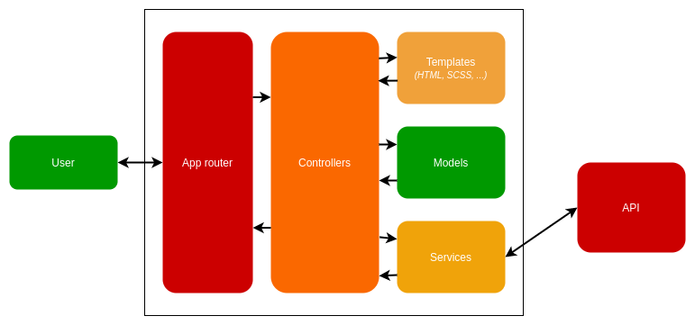

[See the repository](https://github.com/RomainCtl/RecoFinement-ui)

This service is the entrance door for users, it is the interface that will allow them to use the entire application.

It must represent the graphical identity of the application.

!!! seealso
    You can see the user part of this documentation for more information.

## Technologies

We use [Angular](https://angular.io/), it is a TypeScript-based open-source web application framework led by the Angular Team at Google and by a community of individuals and corporations.

We use Material Design components for Angular : [Material Angular](https://material.angular.io/) to simplify UI components creation.

For style, we use [Angular Boostrap](https://ng-bootstrap.github.io/), it is an angular widgets using only Bootstrap 4 CSS.

[Bootstrap](https://getbootstrap.com/) is a free and open-source CSS framework directed at responsive, mobile-first front-end web development.

## UI Architecture Schema

