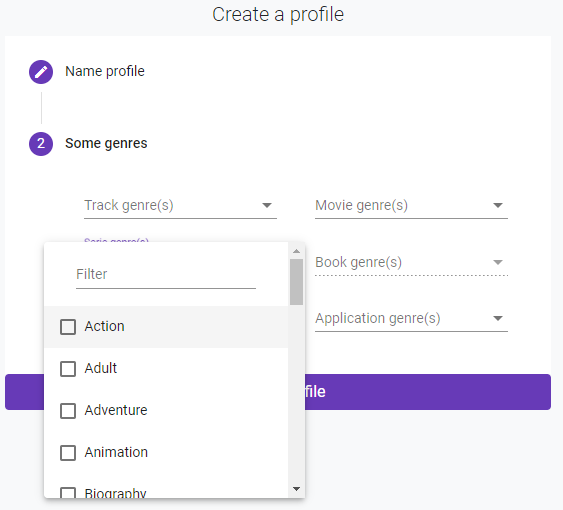
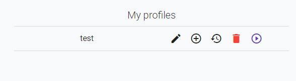
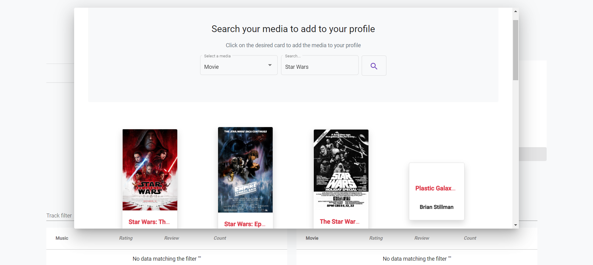
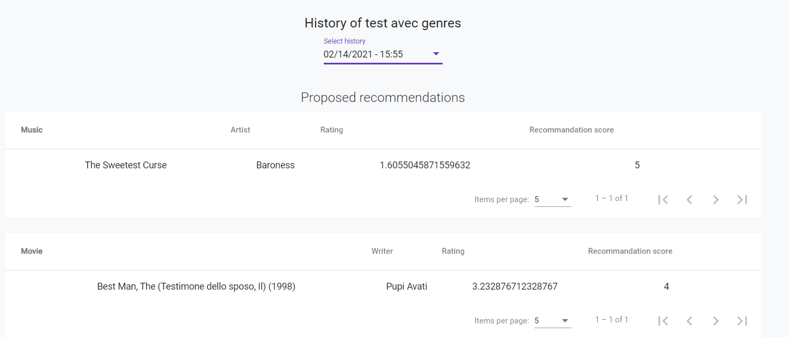

# Administration panel
!!! warn 
you must have the admin role

In this section, you can use the **Sandbox** and **validate a media** added by users.

To access to the administration panel, please click on "Admin" in the navbar

## Sandbox
 
The sandbox is a tool provide to administator to analyse the recommendation engine through profiles created previously.

### Test profiles
The admin can create profiles and attribute it liked genres.

Once profile is created, it appears in the "My profiles" section.

### Content of test

!!! info 
Click on "+" to access. 

This feature allows the admin to add a media which was already in the Recofinement database.

Moreover, he can edit it's metadata (the rating, review, count) by clicking directly on the data.

### Recommendation analysis

This feature allows the admin to get an history of each tests done by selecting a date.

## Add media validation
The admin has a list with all the media added manually by users. He has the power of accept or decline.

