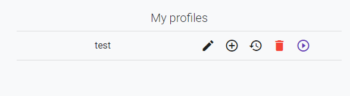

# Sandbox
 
The sandbox is a tool provide to administator to analyse the recommendation engine through profiles created previously.

## Test profiles
The admin can create profiles and attribute it liked genres.

Once profile is created, it appears in the "My profiles" section.

## Content of test

!!! info 
Click on "+" to access. 

This feature allows the admin to add a media which was already in the Recofinement database.

Moreover, he can edit it's metadata (the rating, review, count) by clicking directly on the data.

## Recommendation analysis

This feature allows the admin to get an history of each tests done by selecting a date.

