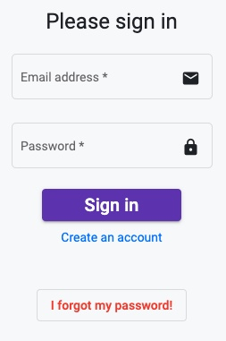

# How to sign in?

After you get registered, the next time you will be willing to access the interface again you will have to sign in.

The sign is process requires your e-mail address and your password.

In case you forgot your password, you will be able to change it by clicking on `I forgot my password` button and filling in the e-mail address linked to your account.

We will then send you an e-mail with link to recover your password.

