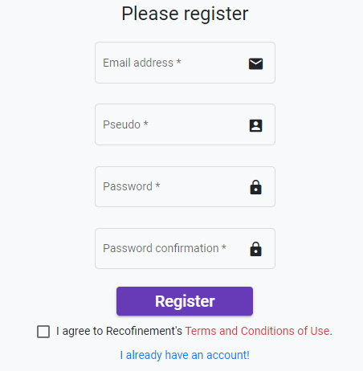
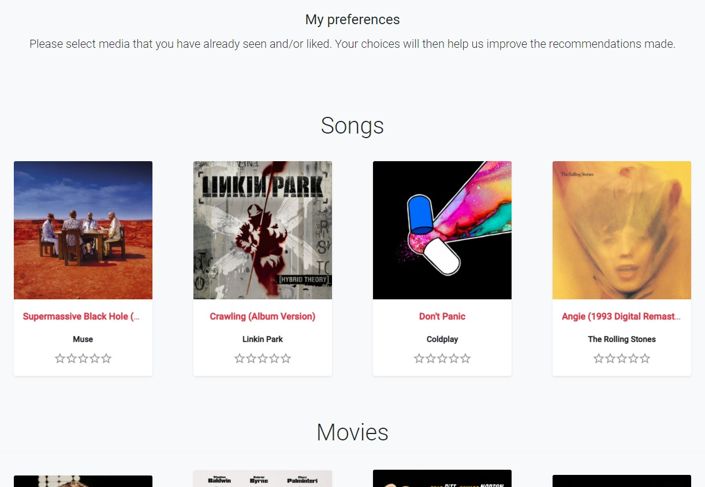

# How to get registered?

First, you land on the login page. If you don't have an account yet you can click on `Create an account` and you will be redirected to the register form. 

In order to get registered you need to provide the following information:

- Email address
- Pseudo
- Password
- Password confirmation

Once you have filled up the form you can click on Register.

Then, you will have to tell us your preferences regarding each type of media that Recofinement supports.
This step allows us to feed our recommendation system.

Once this is done, you access the main part the interface.
