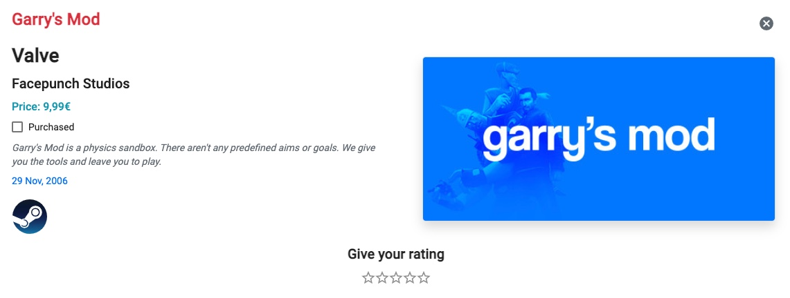

Under the `Games` section you can see your recommended games.

You can see more information about a specific game by clicking on the `See more` button. Then, a pop-up appears and shows the following information:

- Name
- Developer
- Publisher
- Price
- Description
- Release date
- Cover

## Steam

You can click on the Steam logo in order to display the game on Steam.

!!! tip
    You can indicate whether you have purchased the game or not.

!!! information
    Giving a rating to a game helps us showing you more relevant content.
