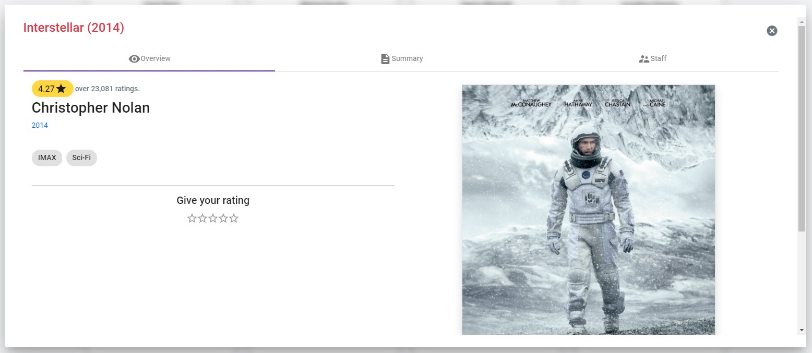

Under the `Movies` section you can see your recommended movies.

You can see more information about a specific movie by clicking on the `See more` button. Then, a pop-up appears and shows the following information:

- Overview
    - Ratings
    - Director
    - Year
    - Genre
    - Cover
- Staff
    - Actors
    - Directors
    - Writers

!!! tip
    By connecting your TMDB account you will have access to the movies you liked on this platform in **Recofinement**.

!!! information
    Giving a rating to a movie helps us showing you relevant content.
