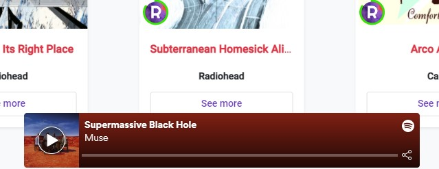

Under the `Musics` section you can see your recommended musics.

When you hover a specific music a play button appears and you can listen to a preview of the music.

!!! tip 
    You can listen to the whole music if you have connected your Spotify account under **Profile** > **Manage a profile** > **Third-party applications**

You can see more information about a music by clicking on the `See more` button. Then, a pop-up appears and shows the following information:

- Track title
- Ratings
- Artist
- Album cover

!!! information
    Giving a rating to a music helps us showing you relevant content.
    
