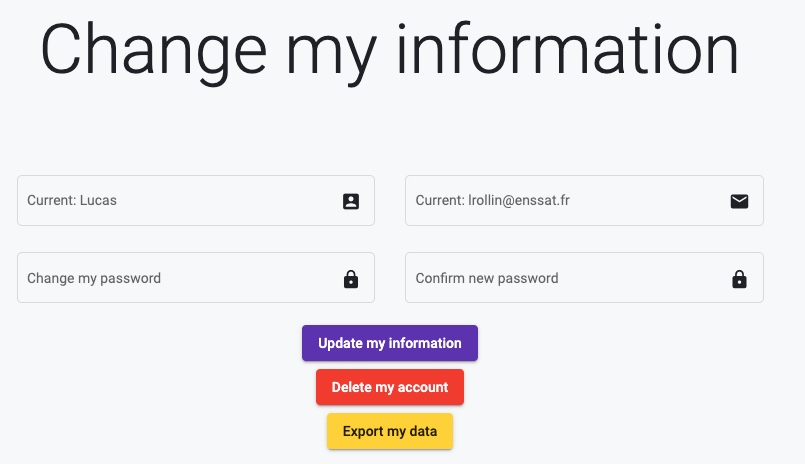

In this section, you can **edit the information** you previously entered, **export your data** and **delete your account**.

## Edit your information

Here are the things you can change: 

- Username
- E-mail address
- Password

## Export your data

If you want to know the data we store, you can click on the `Export my data` button. A `data.json` file will be downloaded.

## Delete your account

Once you click on this button, all the information we have concerning your profile will be deleted.

!!! warning
    Make sure to export your data before you delete your account. Once your account is deleted, we won't be able to retrieve your data. 

