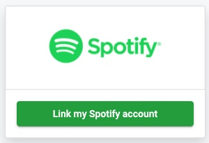
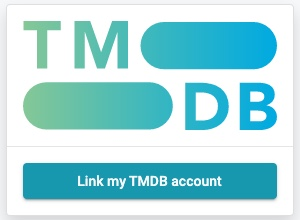
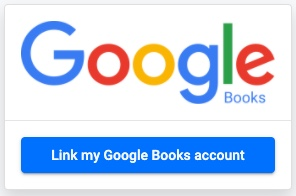

In this section you can connect to other services in order to access the content you interacted with.

## Spotify

Connecting your Spotify account will allow you to listen to the full musics in th music section.

You will also have your listening history displayed in the related section.

Once you click on `Link my Spotify account`, you will be redirected to Spotify website in order to sign in to your account. When this is done you go back to Recofinement's application. Well done, your Spotify account is now linked.

## The Movie Database

Once you click on `Link my TMDB account`, you will be redirected to TMDB website in order to sign in to your account. When this is done you go back to Recofinement's application. Well done, your TMDB account is now linked.

## Google Books

Once you click on `Link my Google Books account`, you will be redirected to Google website in order to sign in to your account. When this is done you go back to Recofinement's application. Well done, your Google account is now linked.